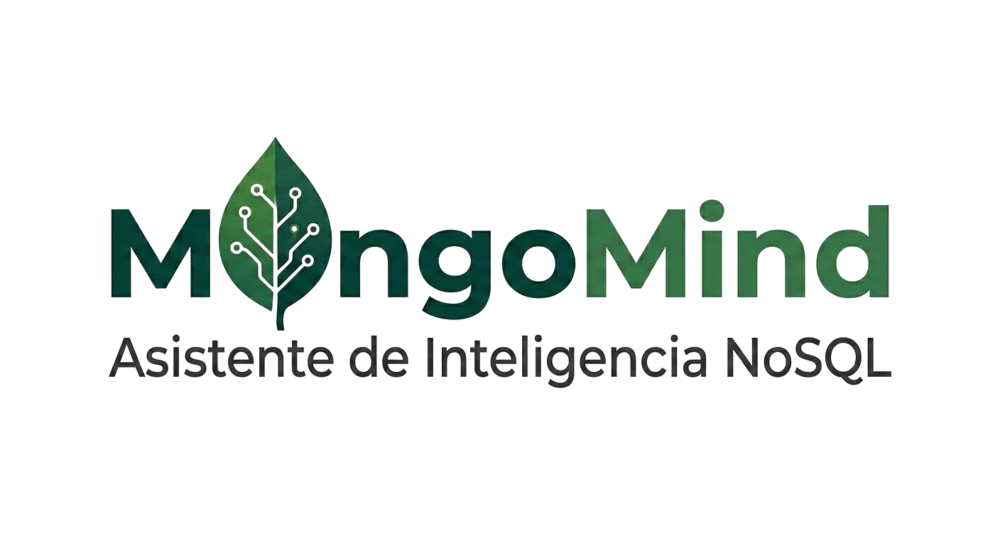

<p align="center">
  
  &nbsp;&nbsp;&nbsp;&nbsp;
</p>

# MongoMind — Asistente de Inteligencia NoSQL

TFM — Máster de Formación Permanente en Deep Learning, Universidad Politécnica de Madrid (2025/26)

**Autor:** Lucas Silva Pérez &nbsp;·&nbsp; **Director:** Alejandro Martín

---

## ¿Qué es MongoMind?

MongoMind es un asistente conversacional que permite a analistas de datos consultar bases de datos MongoDB en lenguaje natural, sin escribir una sola línea de MQL. El usuario formula su pregunta en español o inglés; MongoMind la traduce automáticamente a una query MongoDB, la ejecuta y devuelve los resultados de forma comprensible.

El sistema está diseñado para eliminar la dependencia de perfiles técnicos en el ciclo de análisis de datos: cualquier analista puede obtener respuestas de una base de datos NoSQL compleja con la misma naturalidad con la que haría una pregunta.

## ¿Por qué MongoDB Atlas?

MongoDB Atlas es el servicio cloud oficial de MongoDB. Se usa en este proyecto por tres razones concretas:

- **Dataset de referencia listo para usar** — Atlas ofrece `sample_mflix`, un dataset público de películas con relaciones entre colecciones (`movies`, `comments`, `users`), ideal para cubrir todos los tipos de query que queremos evaluar.
- **Sin infraestructura local** — el tier gratuito (M0) permite desarrollar y evaluar el sistema sin gestionar instancias propias, lo que reduce la fricción durante el desarrollo del TFM.
- **Entorno realista** — las restricciones de red, autenticación y TLS de Atlas simulan las condiciones de un despliegue real, lo que hace que el sistema sea directamente transferible a producción.

## Arquitectura

```
Pregunta en lenguaje natural
        │
        ▼
   src/core/nlp.py           →  detecta la colección objetivo
        │
        ▼
   src/core/mql_generator.py →  LLM + few-shot prompting → MQL
        │
        ▼
   src/core/db_connector.py  →  ejecuta la query en MongoDB Atlas
        │
        ▼
   src/web/app.py            →  devuelve resultados + MQL generado
```

## Stack

| Capa | Tecnología |
|---|---|
| Modelo NL→MQL | Ollama + `llama3.2` (local, sin API key) |
| Base de datos | MongoDB Atlas (sample_mflix) |
| Backend | FastAPI + Uvicorn |
| Dataset de evaluación | `data/benchmark/` |

## Instalación

```bash
conda create -n tfm python=3.11
conda activate tfm
pip install -r requirements.txt
cp .env.example .env   # añadir MONGODB_URI
```

> Requiere [Ollama](https://ollama.com) instalado y ejecutándose en `localhost:11434`. Descarga el modelo con `ollama pull llama3.2`.

## Uso

```bash
# Interfaz web
python src/web/app.py   # http://localhost:8000
```

En la cabecera de la web puedes elegir el **dataset** sobre el que consultar
(`sample_mflix`, `sample_airbnb`, `sample_analytics`). El registro de datasets
está en `src/core/datasets.py`.

## Datasets adicionales (multi-dataset)

`sample_mflix` ya cubre la evaluación principal. Para probar la generalización a
otras bases de datos, MongoMind soporta también `sample_airbnb` y
`sample_analytics`. Hay dos formas de cargarlos en tu cluster:

**Opción A — UI de Atlas (oficial, carga todos los sample datasets):**
Cluster → `...` → *Load Sample Dataset*. Tarda unos minutos y crea todas las
bases `sample_*`.

**Opción B — script (solo airbnb + analytics):**
Requiere un usuario de MongoDB con permisos de **escritura** (el usuario de
producción es de solo lectura). Define su `MONGODB_URI` en el entorno y ejecuta:

```bash
python scripts/load_sample_datasets.py            # clona el mirror y carga ambos
python scripts/load_sample_datasets.py --drop     # recrea las colecciones
```

El script clona automáticamente un mirror público de los datos (NDJSON) e
inserta vía PyMongo. Tras cargar, vuelve a dejar la conexión en solo lectura.

Verifica la carga:

```bash
python tests/multi_dataset_test.py   # requiere Ollama + Atlas
```

## Estructura

```
src/
  core/        # db_connector · mql_generator · nlp · schema_inferrer · datasets
  web/         # FastAPI app + templates HTML
  prompts/     # plantillas few-shot por colección (movies.txt, …)
data/
  schemas/     # esquemas JSON de colecciones (movies.json, …)
  benchmark/   # pares (pregunta NL, MQL esperado) para evaluación
scripts/       # utilidades (load_sample_datasets.py)
tests/
```

## Tests

```bash
# Tests unitarios (sin Ollama ni Atlas)
pytest tests/test_mql_generator.py tests/test_schema_inferrer.py -v   # 36 tests

# Tests de integración (requieren Atlas)
pytest tests/test_db_connector.py -v                                   # 6 tests

# Smoke test end-to-end (requiere Ollama + Atlas)
python tests/smoke_test.py
```

## Estado actual

- [x] Entorno y conexión a MongoDB Atlas verificada
- [x] `db_connector.py` — find y aggregate con límite de seguridad
- [x] Esquema `movies.json` y plantilla few-shot `movies.txt` (12 ejemplos)
- [x] `mql_generator.py` — generación MQL vía Ollama (`llama3.2`, local)
- [x] `nlp.py` — detección de colección por palabras clave
- [x] `schema_inferrer.py` — inferencia dinámica de esquema desde documentos reales
- [x] Pipeline end-to-end `nlp → mql_generator → db_connector`
- [x] Interfaz web FastAPI
- [ ] Benchmark y evaluación comparativa de modelos
